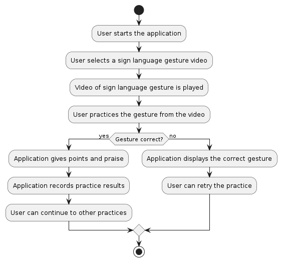

# Sign Language Learning Application

### Overview
Communication is a crucial aspect of daily life. For individuals with hearing and speech impairments, sign language serves as a primary means of communication, allowing them to interact with the world around them. However, learning sign language can be challenging due to limited access to resources and lack of interactivity, making the learning process less effective and engaging.

To address these challenges, we have designed **SignEase**, a technology-based application that utilizes artificial intelligence (AI) to assist individuals with hearing and speech impairments in learning sign language. By using gesture recognition technology, SignEaser provides an interactive and enjoyable learning experience for its users.

 **SignEase** is a machine learning-powered application designed to assist individuals with hearing and speech impairments in learning sign language. The application utilizes video classification to interpret sign language gestures and provides users with interactive lessons and feedback. By leveraging machine learning algorithms,  SignEase aims to make learning sign language accessible, engaging, and effective

### Team Members
- **Fiki Aprian**
  - **Role:** Backend Developer
  - **Interests & Activities:** Passionate about machine learning and cloud computing, with a focus on developing solutions for social impact.
  - **Portfolio:** https://my-portofolio-fikiap23.vercel.app
  - **LinkedIn:** [Fiki Aprian](https://www.linkedin.com/in/fiki-aprian-b8624b216/)
  - **GitHub:** [https://github.com/fikiap23](https://github.com/fikiap23)

- **Megan Madellin**
  - **Role:** Frontend Developer
  - **Interests & Activities:** Interested in creating user-friendly interfaces and accessible web applications.
  - **Portfolio:** [Portfolio URL]
  - **LinkedIn:** [Megan Madellin](https://www.linkedin.com/in/megan-medellin-884180287/)
  - **GitHub:** [http://github.com/meganmedellin](http://github.com/meganmedellin)

- **Anissa Tri Lahitani**
  - **Role:** Backend Developer
  - **Interests & Activities:** Passionate about backend applications for social good.
  - **Portfolio:** https://lahitanido26.github.io/MyPortofolio/
  - **LinkedIn:** [Anissa Tri Lahitani](https://www.linkedin.com/in/anissa-tri-lahitani)
  - **GitHub:** [https://github.com/lahitanido26](https://github.com/lahitanido26)

- **Mohammad Ezra Nur Islami**
  - **Role:** ML Developer
  - **Interests & Activities:** Interested in developing machine learning solutions to address real-world challenges.
  - **Portfolio:** https://heyzra.github.io/hizra.github.io/
  - **LinkedIn:** [Mohammad Ezra Nur Islami](https://www.linkedin.com/in/mohammad-ezra/)
  - **GitHub:** [https://github.com/heyZra](v)

### Topic and Motivation
This project focuses on using image classification to recognize and classify American Sign Language (ASL) gestures. It features an interactive interface where users can practice ASL gestures and receive immediate feedback on accuracy. Quiz features are available for users to test their understanding.

The application aims to enhance ASL education by leveraging image classification technology, making learning more accessible for individuals with hearing and speech impairments. It seeks to improve the efficiency and effectiveness of ASL learning for all users interested in sign language education.

The motivation behind  SignEase stems from the desire to bridge the communication gap for individuals with hearing and speech impairments. Sign language is a vital form of communication for this community, yet resources for learning can be limited and inaccessible. By developing a machine learning application that teaches sign language in an engaging and interactive manner, we aim to empower individuals with hearing and speech impairments to learn and communicate effectively.

Cooperate with one another in goodness and righteousness, and do not cooperate in sin and transgression. And be mindful of Allah. Surely Allah is severe in punishment. – **(Q.S Al-Maidah: 2)**

### Target User Group
This platform allows users to practice ASL gestures with real-time feedback using image classification technology for precise recognition. It caters to users of all ages and backgrounds seeking to enhance communication skills and learn sign language effectively. Features include quizzes and resources for reinforcing ASL proficiency, offering immediate feedback to aid improvement.

### Proposed Solution

#### Product Branding
The product will be branded as "SignEase," symbolizing its goal of making sign language communication easier and more accessible for everyone.

#### Description
Summary:
SignEase provides a comprehensive platform for learning sign language, offering interactive lessons, quizzes, and practice exercises. It uses machine learning to interpret users' gestures, offering real-time feedback and personalized suggestions. With gamification elements and tailored learning paths, SignEase makes sign language learning engaging, effective, and enjoyable.

#### How This Project Relates to SDGs
This project aligns with several Sustainable Development Goals (SDGs), including:
- Goal 3: Good Health and Well-being, by improving communication access for individuals with hearing impairments.
- Goal 4: Quality Education, SignEase promotes inclusive and equitable education by providing accessible resources for individuals with hearing and speech impairments to learn sign language..
- Goal 10: Reduced Inequalities, By facilitating communication and understanding for individuals with hearing and speech impairments, SignEase contributes to reducing inequalities and promoting social inclusion.

#### Application Flow Chart

#### Application Design and Illustration

### Research Questions and Objectives
*   **Research Question:** How can machine learning algorithms be effectively utilized to facilitate the learning of sign language?
*   **Objectives:**
    1.  Develop a machine learning model capable of recognizing and interpreting sign language gestures.
    2.  Create an interactive and user-friendly application interface for learning sign language.
    3.  Evaluate the effectiveness of the application in improving users' sign language skills and communication abilities.

### Research Methodology
The research methodology for SignEase includes:

*   Data Collection: Gathering a diverse dataset of sign language gestures for training the machine learning model.
*   Model Development: Training and optimizing a machine learning model for sign language gesture recognition.
*   Application Development: Designing and implementing the application interface for SignEase.
*   User Testing: Conducting usability testing and gathering feedback from users to improve the application.

### Methods and Technologies
- TensorFlow, scikit-learn for machine learning model development
- NestJs, Prisma, PostgresSQL for backend development
- Flask for backend ML (Deploy Model)
- React for frontend development web
- Kotlin for mobile frontend development 

### Time Tables
*   **Phase 1: Research and Planning (Month 1)**
    
    *   Conduct research on sign language recognition and machine learning algorithms.
    *   Define project requirements and objectives.
    *   Plan the development and implementation strategy.
*   **Phase 2: Development (Months 2-4)**
    
    *   Develop the machine learning model for sign language recognition.
    *   Implement the frontend and backend components of the application.
    *   Integrate the machine learning model into the application interface.
*   **Phase 3: Testing and Evaluation (Months 5-6)**
    
    *   Conduct user testing and gather feedback for improvement.
    *   Evaluate the effectiveness of the application in learning sign language.
    *   Make final adjustments and refinements based on feedback.

### References

### Additional Pages
- [Proposal Link](https://www.canva.com/design/DAGEgiqntso/sw5DbRPi_M3e49yOKYTKkQ/view?utm_content=DAGEgiqntso&utm_campaign=designshare&utm_medium=link&utm_source=editor)
- [Github Link](https://github.com/MachineL-Group/Machine-Learning-Project.git)
- [Promotion Link](https://www.instagram.com/reel/C63wB4rhmLU/?igshid=dTZ1aXBtdHRibWFu)
